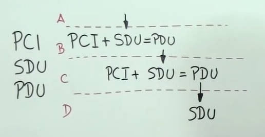
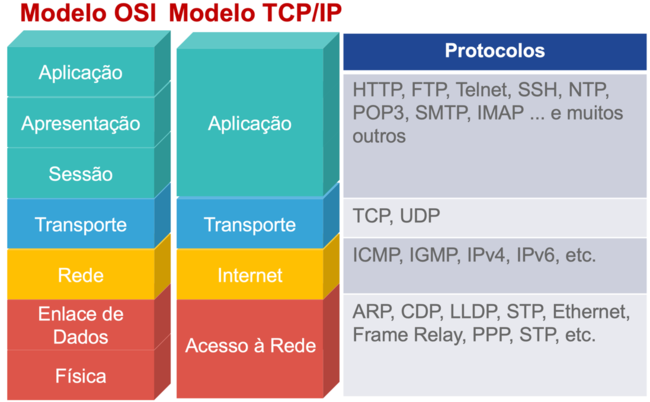

# A Internet

## História da Internet

- Surgiu durante a Guerra Fria (1949 - 1991)
- Os EUA criaram a DARPA (estudo de tecnologias para a guerra)
- A DARPA criou a ARPANET (rede para backup dos dados)
- Utilizava Protocolo NCP (apenas dois pontos se comunicavam por vez)
- Protocolo TCP/IP resolveu este problema
- A ARPANET cresceu e se dividiu em três redes: Militar, Científica e Comercial
- As redes Científicas e Comerciais queriam interagir entre si, surgindo a **INTER**connect **NET**working
- Era apenas texto (linha de comando)

## O que é a Internet?

- **World Wide Web (www)** NÃO é a Internet
- *“www”* é um subdomínio da Internet
- A INTERNET é um conjunto de várias redes
- A Internet é composta por servidores de diversas especialidades

## Existem diversos tipos de servidores

- Servidor de site
- Servidor de streaming
- Servidor de arquivos
- Servidor de e-mail
- E muito mais...

## Meios Físicos para Transferência de Dados

- Satélite
- Cabos de Fibra Ótica pelos Oceanos
- Sistemas de Telefonia
- Sistemas de TV a Cabo
- Redes de Radiofrequência

## Modem

- **MO**dular
- **DEM**odular

## Roteadores

- Conectam redes

## Switch

- Criam uma rede

## MegaBIT (Mb) x MegaBYTE (MB)

- Transmissão x Armazenamento

## Os ‘Nós’ de uma Rede

- **Nó** é um ponto conectado a Rede
- **Protocolo IP** é responsável por identificar os nós
- **Endereço IP** é a identidade dos nós

## Domínio

- É o endereço eletrônico do seu site
- Nome + TLD (Top Level Domain ):
    - **GTLD** (generic): *.com, .net, .gov, .org, .io, .info, .online, .store*
    - **ccTLD** (country code): *.com.br, .jp, .us, .uk*

## Subdomínio

- Cria áreas separadas do site principal
- *www* é um subdomínio que aponta para o servidor web padrão
- Exemplos de Subdomínios:
    - *www*.google.com.br
    - *images*.google.com.br
    - *maps*.google.com.br
    - *mail*.google.com.br

## Nameserver e Registro DNS

- Os **Nameservers** são a *“lista telefônica”*
- Os **Registros DNS** são os *“contatos individuais”* na lista telefónica, como o IP do seu servidor

## URL

- É o endereço de um recurso na internet
- Protocolo + Subdomínio + Domínio + TLD + Caminho
- `https://www.cozinhacaseira.com.br/receitas/bolo-de-chocolate`

## Hipertexto 

- É um texto que agrega imagens, sons e outros dados
- São NÃO LINEARES e conectados por HIPERLINKS

## HTTP

- _Hypertext Transfer Protocol_
- é um protocolo especializado em Hipertexto
- tem a função de estabelecer a troca de mensagens entre computadores
- as conversas entre um client e um server são chamadas de _messages_, as quais se classificam em:
    - **REQUEST** - do client pro server
    - **RESPONSE** - do server pro client
- um documento completo é construído a partir dos diferentes sub-documentos obtidos, como por exemplo texto, descrição do layout, imagens, vídeos, scripts e muito mais.

## TCP

- Transmission Control Protocolo
- Garante que os pacotes cheguem corretamente ao destino

## IP Estático x Dinâmico

- Servidor/VPN x Segurança/Facilidade de Configuração

## Como Funciona a Web

- você digita a URL: `https://www.rocketseat.com.br`
- é iniciada uma linha de comunicação, através do protocolo TCP, entre o Cliente e o Servidor
- a URL é convertida em um endereço de IP através do DNS
- seu pedido percorre diversos Proxies
- seu pedido chega até o servidor
- servidor analisa seu pedido e te dá uma resposta
- o caminho de volta é semelhante ao de ida
- o browser recebe os pedaços e monta a tela do site para você
- para cada recurso (html, css, javascript, imagem...) é feita uma nova conexão

## Hospedagem

- **Data Center** é um ambiente projetado para abrigar servidores
- Empresas de Hospedagem contratam data centers 
- Provedores de hospedagem podem ter infraestrutura própria ou alugada

## Máquinas Virtuais x Containers

- **Container** - isolamento de processos x roda o mesmo SO 
- **Máquinas Virtuais** - isolamento de maquina x roda diferentes SO

## Tipos de Hospedagem

- Hospedagem Gratuita
- Hospedagem Compartilhada
- Servidor Dedicado
- Hospedagem Cloud (containers)
- Hospedagem VPS (máquina Virtual)
- Colocation (dono de fato)
- Revenda de Hospedagem

## Ameaças Virtuais

- Malware 
    - Vírus
    - Worms ("vermes")
    - Bot
    - Adwares 
    - Phishing 
    - Trojans
    - Ransomwares 
    - Spywares 
        - Keylogger
        - Screenlogger 
    - Stalkerwares 
    - Backdoor 
    - Rootkit 
    - Hijacker

## Webpage

- É uma página web “individual” 

## Website (ou Site)

- É um conjunto de páginas (webpages) que funciona sob um único domínio
- Pode ser *Estático* ou *Dinâmico*

## Site x Blog x Loja Virtual

- um *Site* fala sobre a marca/empresa
- uma *Loja Virtual* vende os seus produtos 
- um *Blog* divulga conteúdos relacionados à marca

## Aplicação Web

- É um PROGRAMA acessado através de páginas web e navegador
- Programação avançada e interação com Banco de Dados
- Trabalha com *Conteúdo Dinâmico*
- *"Executa tarefas? Aplicação Web. Apenas entrega informações? Website"*

## Aplicação Web Tradicional x SPA

- **Aplicação Web Tradicional**: necessita recarregar a página inteira para atualizar o conteúdo
- **SPA (Single Page Application)**: sensação de ter uma única página

## Protocolos POP3, SMTP e IMAP
- **POP3** - é usado para baixar os e-mails para um cliente de e-mail como o Outlook, o Thunderbird, o Windows Mail, o Mac Mail, etc...
- **IMAP** - também é usado para baixar os e-mails, no entanto, o conteúdo da mensagem de e-mail real são deixados no servidor (sincronia).
- **SMTP** - é usado para enviar o e-mail para o servidor remoto e eventualmente para o servidor de e-mail do destinatário.

## Web 3.0

- **Web 1.0** - páginas estáticas e sem interação
- **Web 2.0** - interatividade, redes sociais e produção de conteúdo
- **Web 3.0** - inteligência artificial, machine learning e blockchain (redes descentralizadas) 

## Metaverso

- espaço virtual compartilhado
- uma evolução da nossa internet atual.
- mais do que navegar na internet, será possível vivenciá-la por dentro:
    - Realidade Virtual
    - Realidade Aumentada

## Everything as a Service

- **EaaS** - Everything as a Service - advento do cloud computing
- **SaaS** - Software as a Service
- **IaaS** - Infrastructure as a Service
- **PaaS** - Platform as a Service 

## Modelo OSI

- Modelo OSI (Open System Interconnection)
- definido pela ISO
- tem o objetivo de estabelecer um padrão para protocolos de comunicação entre redes as quais podem podem possuir hardwares, programas e sistemas operacionais de diferentes fabricantes
- divide as redes de computadores em 7 camadas, de forma a se obter camadas de abstração
- não especifica os serviços e protocolos exatos que devem ser usados em cada camada, apenas informa o que cada camada deve fazer
- funciona como um "fluxo postal", em que cada camada (remetente, correio, carteiro, aeroporto, alfândega, etc...) possui um padrão de funcionamento e inclui suas próprias _informações de controle_ que são úteis para a camada seguinte
- é um modelo mais novo que o Modelo TCP/IP e explica melhor o funcionamento de uma rede

As camadas são empilhadas na seguinte ordem:

|Nível|Camada|Descrição|
|---|---|---|
|7|Camada de Aplicação|É a camada para consumir os dados. Aqui temos os programas que garantem a interação humano-máquina. É onde estão os protocolos das aplicações.|
|6|Camada de Apresentação|Também chamada de "Camada de Tradução". É quem realiza a conversão dos formatos de caracteres para que eles possam ser utilizados na transmissão. Também é responsável pela compressão e criptografia.|
|5|Camada de Sessão|É responsável por estabelecer e encerrar a conexão entre hosts. É ela quem inicia e sincroniza os hosts.|
|4|Camada de Transporte|Gerencia o transporte dos pacotes para garantir o sucesso no envio e no recebimento de dados.|
|3|Camada de Rede|Responsável pelo endereçamento dos dispositivos na rede, bem como o caminho que as informações devem percorrer da origem até o destino. Basicamente controla o roteamento entre a origem e destino do pacote.|
|2|Camada de Enlace|Responsável pela detecção e correção de erros que tenham ocorridos no nível físico. Também realiza o controle do fluxo da transmissão de dados entre um dispositivo e outro. |
|1|Camada Física|Estabelece a comunicação real entre dois dispositivos. Responsável pelos meios de transmissão, cabeamento de rede, características elétricas, óticas e eletromagnéticas nas redes sem fio|

### A Comunicação entre as Camadas

- a camada no "topo" tem uma informação que irá passar para a camada de baixo
- a camada de baixo efetua o _encapsulamento_ estas informações, acrescentando _informações de controle_ de sua respectiva camada
- este novo "conjunto de informações" passa então para a camada inferior que passa novamente por um novo processo de encapsulamento e acréscimo de informações de controle
- quando a informação chega na outra "ponta" da comunicação ocorre o processo reverso de _desencapsulamento_

### Nomes Utilizados na Comunicação entre as Camadas

- **PCI (Protocol-Control Information)** - são as informações de controle da camada
- **SDU (Service Data Unit)** - é como a camada "enxerga" uma unidade de dados que foi recebida 
- **PDU (Protocol Data Unit)** - é uma unidade de dados encapsulada após o SDU receber o PCI da camada 

Resumindo: **PCI + SDU = PDU**

## Modelo TCP/IP

- também conhecido como **Modelo Internet** e **Pilha TCP/IP**
- o Modelo OSI é um modelo de referência
- o Modelo TCP/IP é o que está efetivamente em prática na internet
- também é um modelo de camadas, porém, com apenas 4 niveis

